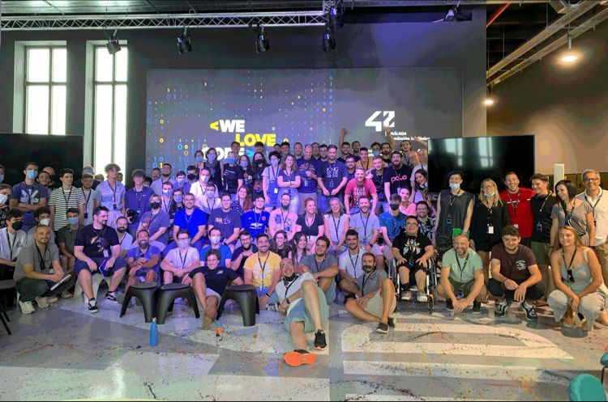

# 42-Piscine

## Aviso a piscinerxs

Si llegas a este repositorio por estar buscando información sobre la piscina, quisiera invitarte a recordar el mejor consejo de la piscina:
> Pregunta a tu izquierda, pregunta a tu derecha y, si ellos no lo saben, pregunta a Google.

Con esto quiero animarte a que, antes de revisar este repositorio, participes y hagas piña con tus compañerxs. Es la mejor experiencia que puedes llevarte en este mes. 

Si, después de esto, sigues necesitando buscar información recuerda que no es correcto incluir en tu trabajo ninguna línea de código que no hayas entendido previamente. 
Eso solo sirve para autoengañarte, empeorará tu aprendizaje y es posible que obtengas un mal resultado en la evaluación.

## Get started

He considerado que la mejor forma de describir en qué consiste este repositorio es transcribir la publicación que en su momento (Julio de 2022) escribí en mi perfil de Linkedin:

---

    El pasado viernes terminé un intensísimo periodo de 26 días en la piscina de 42 Málaga Fundación Telefónica.
    
    Este es un proceso de selección destinado a evaluar si la metodología de 42 es adecuada para mi desarrollo digital de cara a participar en el futuro de un periodo de formación más prolongado (conocido como "cursus").
    
    La filosofía de 42 se basa en un campus gratuito, sin libros, sin clases, sin profesores y abierto 24/7.
    Pese a todos mis años de formación universitaria, de impartir clases, de reuniones y encuentros, puedo decir que nunca había vivido una experiencia parecida: Allí, de alguna forma, todo está preparado para retar y meter en problemas hasta al programador más experimentado.
    
    Los amagos individualistas de "yo sé y yo solo puedo" tienen escasa duración (¿quizás los primeros 10 minutos?) y pronto son frustrados. Enseguida te das cuenta de que la respuesta a tus problemas las vas a encontrar preguntando a tu izquierda, preguntando a tu derecha y, si nadie lo sabe, preguntándole a Google.
    
    Me pasé un año estudiando las teorías pedagógicas sobre el aprendizaje cooperativo y ha sido aquí donde me he dado cuenta de que verdaderamente el "peer to peer" funciona. Se retiene mucho más ayudando y siendo ayudado, que leyendo muchos libros en aislamiento o pendiente de una explicación estática en pizarra.
    
    Ha sido un mes en el que me he reído muchísimo, he aprendido, he descubierto otras culturas y formas de ver la vida (por estar en ambiente tanto internacional como intergeneracional) y he conocido a compañer@s a los que tengo muchísimo cariño y con los que sé que siempre podré seguir quedando tanto para tomar unas cervezas como para hablar y compartir sobre proyectos y experiencias profesionales.
    
    Gracias, 42 Málaga :)

---

